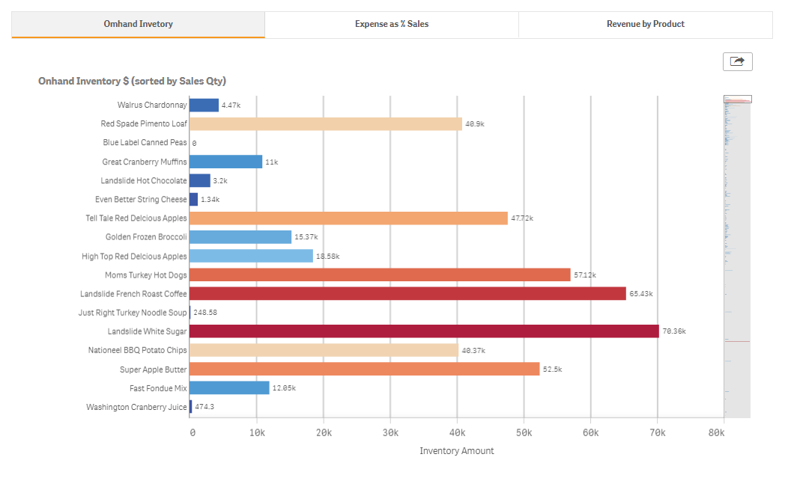

# Tabs for Qlik Sense
The **Tabs for Qlik Sense** is an extension which allows you to add tabs on Qlik Sense.

## Screen shot

## Install
1. Download the latest version of Tabs for Qlik Sense extension from [releases](https://github.com/mhamano/Qlik-Sense-Tabs/releases).
2. Install extension:
  * Qlik Sense Desktop
	 * To install, copy the folder included the .zip file to folder "C:\Users\[%Username%]\Documents\Qlik\Sense\Extensions\".
  * Qlik Sense Enterprise
	 * Import the zipped extension file on QMC by following the instructions of [Importing visualizations in Qlik Sense Enterprise](http://help.qlik.com/en-US/sense-developer/June2017/Subsystems/Extensions/Content/Howtos/deploy-extensions.htm)

## Usage
1. Open a Qlik Sense App.
2. Create charts you would like to display on the tab extension and add them to master items. (You can delete the charts after you added them to master items.)
3. Drag and drop the "Tabs" extension onto the canvas.
4. On the extension property panel, navigate to [Settings] > [Properties] and change the "Number of Tabs".
5. Select a chart on the drop-down list and modify the label for each tab on the property panel.

## Limitations
1. Right-click context menu (including take snapshot, open exploration menu, export to PDF, etc) is disabled for tabbed chart.
2. Data export button on the tabs can be used only for those charts which support data export.

## Author
**Masaki Hamano**
* https://github.com/mhamano/

## License & Copyright
The software is made available "AS IS" without any warranty of any kind under the MIT License (MIT).

See [Additional license information for this solution.](LICENSE.md)
